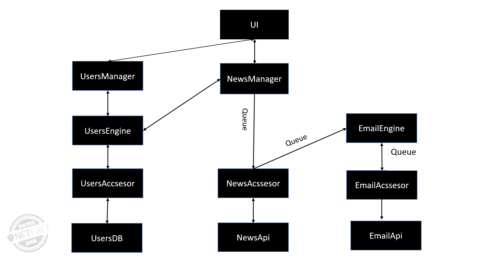

# News Update Aggregator

This project is a web application designed to get News Update Aggregator.
with manage users in mongo db .
 It integrates with Docker and Dapr for microservices News Update Aggregatormanagement .

## Getting Started:
1. Clone the repository.
2. Navigate to the project directory.
3. * Run the command `docker-compose up` to start the services and their Dapr sidecars.
    * or run each service with the command `npm start`

## Technologies Used:
- Node js: used to develop the microservices.
- Dapr: An event-driven, portable runtime for building microservices.
- Docker: A platform used to containerize and manage the microservices.
- RabbitMQ: A message broker for the communication between the microservices.
- MongoDB: The database used to store and retrieve users entries.

## Architecture:
#### USERS SERVICES
- Manager Service: Accepts requests (Get, Post, Put ) related to users entries, and move to emgine with  Dapr SDK.
- Engine Service: Accepts requests (Get, Post, Put ) related to users entries, validates them,check or create token and move to acssesor with  Dapr SDK.
- Accessor Service: get the request, and performs actions on MongoDB.
 #### NEWS SERVICES
- Manager Service: Accepts requests to get news and call to user manager toget preference of user , and push this  to Rabbit MQ.
- Accessor Service:listen to queue  get the request ,process the request and connect to API to get news acoording  prefference .
push the news to anew queue.

 #### EMAIL SERVICES
- Engine Service:listen to queue  Accepts the daily news and desighn itwith HTML and CSS, 
push the process news to queue.
- Accessor Service:listen to queue  get the daily news and user  deatails ,connect to mailjet API and send email to user.
### more services
- RabbitMQ: Used as the messaging system for the exchange of requests between the Manager and Accessor services.
- Dapr: Handles the communication between the Manager and Accessor services and the RabbitMQ queue.
- MongoDB: The database used to store and retrieve phone entries.

## API Endpoints
- PUT `http://127.0.0.1:3003/v1.0/invoke/usersEngine/method/updateUser`: Updates user data.
- POST `'http://127.0.0.1:3003/v1.0/invoke/usersEngine/method/createUser'`: Adds a new user.
- POST  `'http://127.0.0.1:3003/v1.0/invoke/usersEngine/method/getUser'`: Fetches a user based on email and password.
- POST `'http://localhost:3022/newsrequest`: toget the daily news acoording personal prefference.
### POSTMAN COLLECTION
 https://zionet.postman.co/workspace/zionet-Workspace~12b94e28-9080-4380-8339-7b6d55814e84/collection/37608556-d39a8311-e26b-4aa0-a8d2-b9d062fc910f?action=share&creator=37608556
## Database Models

- **Users**: Stored in MongoDB with fields: `userId`, `name`, `email`, `password`, `keywords`, `language`, `country`, `category`.

## Docker Configuration

- **Ports**: The application exposes port 3000 inside the container, mapped to the host's port for access.
- **Dapr**: Dapr is used to facilitate microservices communication.

